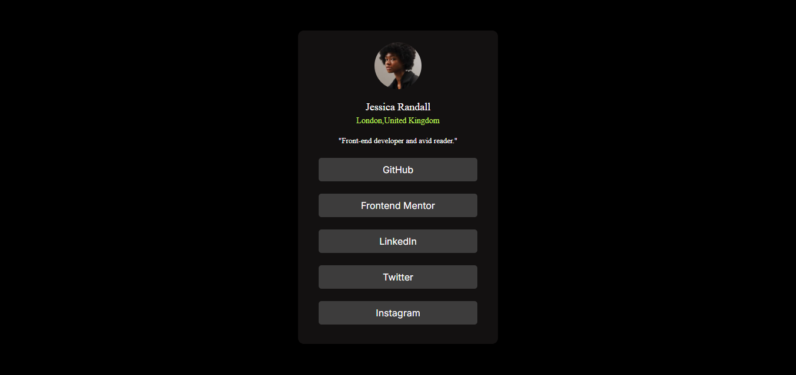

## Social Links Profile

A clean and responsive social profile card built using HTML and CSS.
This project features a user avatar, name, location, short bio, and social media links, all styled with a dark theme and centered on the page.

## Features
- Dark-themed, minimalistic design
- Responsive layout that centers the card vertically and horizontally
- Profile picture with rounded avatar
- Clickable, styled social media buttons with hover effects

## Live Demo
https://echo-script0.github.io/Social-media-page/

## Screenshot
 

## Technologies
HTML
CSS

## Author
Aisha Adeyemo 
